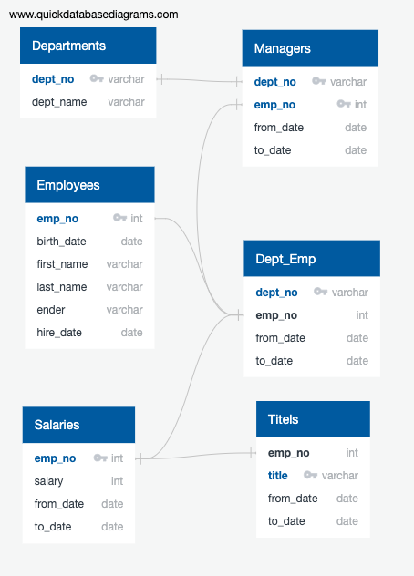
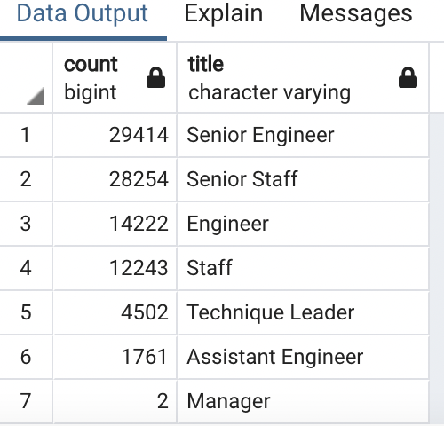
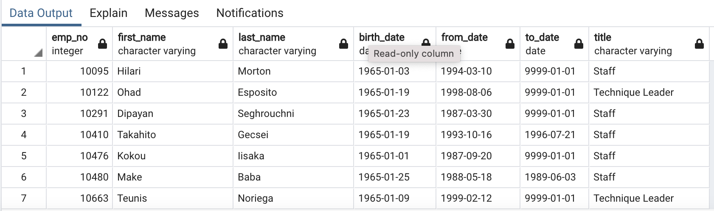

# Pewlett-Hackard-Analysis

## Overview 

The purpose of this analysis is to determine the number of retiring employees per title, and identify employees who are eligible to participate in a mentorship program. 

## Results

The unique titles table that we created is showing the most recent title for employees of retirment age

The final part of our project shows mentorship eligibility

## Summary

- Over 90,000 roles are  need to be filled out as soon as the workforce starts retiring.

- There are not  enough qualified, retirement-ready employees in the departments to mentor the next generation of Pewlett Hackard employees. Pewlett hackard will face difficalties once a majority of eligible employees retire. There are not enouth employees who are eligible to participate in a mentorship program.